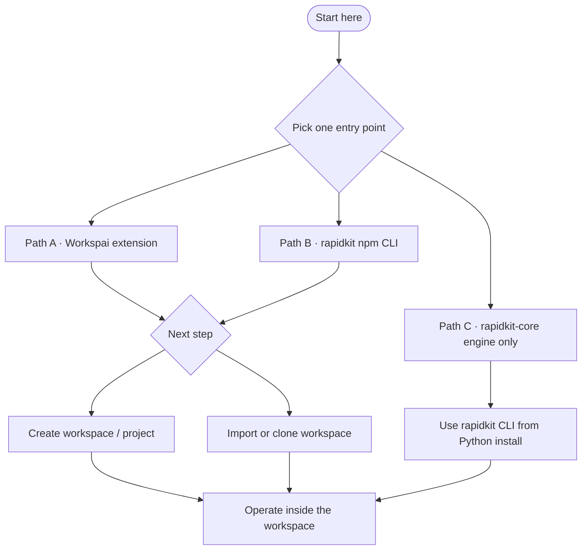

<div align="center">

# RapidKit Labs

**Open-source workspace platform and AI tooling for backend teams.**

Build backend systems with AI that knows your workspace.

[](https://getrapidkit.com)
[](https://workspai.com)
[](https://marketplace.visualstudio.com/items?itemName=rapidkit.rapidkit-vscode)
[](https://www.npmjs.com/package/rapidkit)
[](https://pypi.org/project/rapidkit-core/)
[](LICENSE)

[Install Workspai](https://marketplace.visualstudio.com/items?itemName=rapidkit.rapidkit-vscode) · [npm CLI](https://www.npmjs.com/package/rapidkit) · [PyPI engine](https://pypi.org/project/rapidkit-core/) · [RapidKit](https://getrapidkit.com) · [Workspai Docs](https://workspai.com/docs) · [Discussions](https://github.com/rapidkitlabs/rapidkit-vscode/discussions)

</div>

---

## What we build

**RapidKit Labs** is the public GitHub organization behind the **RapidKit** workspace platform ([getrapidkit.com](https://getrapidkit.com)) and **Workspai** ([workspai.com](https://workspai.com)) — the AI workspace for backend teams in VS Code.

> **Why workspace-first?** Your backend is rarely one repo — it's a system. RapidKit makes the **workspace** your team's operating boundary: policy, projects, modules, health checks, and AI context stay in one place, so every service ships with the same rules, evidence, and understanding — not isolated silos that drift apart.

Supported project families:

**FastAPI** · **NestJS** · **Spring Boot** · **Go/Fiber** · **Go/Gin** · **ASP.NET Core**

---

## Public repositories

| Repository | Description |
| --- | --- |
| [rapidkit-vscode](https://github.com/rapidkitlabs/rapidkit-vscode) | Workspai — AI workspace command center for VS Code |
| [rapidkit-npm](https://github.com/rapidkitlabs/rapidkit-npm) | Official RapidKit CLI (`rapidkit` on npm) |
| [rapidkit-core](https://github.com/rapidkitlabs/rapidkit-core) | Python engine — modules, doctor, bootstrap, reports |
| [rapidkit-examples](https://github.com/rapidkitlabs/rapidkit-examples) | Free example workspaces and templates |
| [rapidkitlabs](https://github.com/rapidkitlabs/rapidkitlabs) | Organization profile (this repository) |

---

## Getting started

Pick **one entry point**. You do not need all three.

After install, either **create** a workspace/project (workspace-first architecture) or **import / clone** an existing workspace.



### Path A — Workspai extension (recommended)

Full dashboard, sidebar, AI, and module browser in VS Code.

**Install**

- Marketplace: [rapidkit.rapidkit-vscode](https://marketplace.visualstudio.com/items?itemName=rapidkit.rapidkit-vscode)
- Or from a terminal:

```bash
code --install-extension rapidkit.rapidkit-vscode
```

**First steps**

1. Command Palette → **Workspai: Open Dashboard**
2. Then either:
   - **Create** — workspace or project (manual, template, or Create with AI)
   - **Import / clone** — open or clone an existing workspace

AI features use GitHub Copilot language models available in your VS Code environment.

---

### Path B — `rapidkit` npm CLI

Workspace-first CLI. Requires **Node.js 20+** ([details](https://github.com/rapidkitlabs/rapidkit-npm#requirements)).

```bash
npx rapidkit --help
```

**Create** — workspace → project → run:

```bash
npx rapidkit create workspace my-platform --profile python-only
cd my-platform
npx rapidkit bootstrap
npx rapidkit setup python
npx rapidkit create project fastapi.standard api
cd api
npx rapidkit init
npx rapidkit dev
```

Check workspace health:

```bash
npx rapidkit doctor workspace
```

Shortcut for interactive workspace creation: `npx rapidkit my-platform`

**Import / clone**

Bring an existing project or repo into a workspace:

```bash
npx rapidkit import ../orders-api
npx rapidkit import https://github.com/acme/orders-api.git --git
```

Or clone a starter workspace, then bootstrap:

```bash
git clone https://github.com/rapidkitlabs/rapidkit-examples.git
cd rapidkit-examples/quickstart-workspace
npx rapidkit bootstrap
npx rapidkit doctor workspace
```

**Essential commands** (full list in [rapidkit-npm README](https://github.com/rapidkitlabs/rapidkit-npm#core-commands)):

| Goal | Command |
| --- | --- |
| Create workspace | `npx rapidkit create workspace <name> --profile <profile>` |
| Bootstrap workspace | `npx rapidkit bootstrap` |
| Setup runtime | `npx rapidkit setup python` · `node` · `go` · `java` · `dotnet` |
| Add project | `npx rapidkit create project <kit> <name>` |
| Import project | `npx rapidkit import <path-or-git-url>` |
| Health check | `npx rapidkit doctor workspace` |
| Run project | `npx rapidkit init` · `npx rapidkit dev` |
| Modules (FastAPI / NestJS) | `npx rapidkit modules list` · `npx rapidkit add module <slug>` |

---

### Path C — Python engine only

Use RapidKit Core directly — no VS Code extension and no npm CLI required.

Requires **Python 3.10+**. Package: [pypi.org/project/rapidkit-core](https://pypi.org/project/rapidkit-core/)

**Install (recommended: isolated CLI)**

```bash
pipx install rapidkit-core
rapidkit --version
rapidkit --help
```

**Alternative (current interpreter / venv)**

```bash
python -m pip install -U rapidkit-core
rapidkit --version
```

**First steps**

```bash
# Interactive
rapidkit create

# Or non-interactive project scaffold
rapidkit create project fastapi.standard my-api
cd my-api
rapidkit init
rapidkit dev
```

Docs and engine issues: [rapidkit-core](https://github.com/rapidkitlabs/rapidkit-core)

---

## Example workspaces

Optional — use when you prefer **import / clone** over creating from scratch.

Clone from [rapidkit-examples](https://github.com/rapidkitlabs/rapidkit-examples):

- [quickstart-workspace](https://github.com/rapidkitlabs/rapidkit-examples/tree/main/quickstart-workspace)
- [saas-starter-workspace](https://github.com/rapidkitlabs/rapidkit-examples/tree/main/saas-starter-workspace)
- [my-ai-workspace](https://github.com/rapidkitlabs/rapidkit-examples/tree/main/my-ai-workspace)

More templates: [workspai.com/examples](https://workspai.com/examples)

---

## Where to get help

| Need | Channel |
| --- | --- |
| Extension | [rapidkit-vscode/issues](https://github.com/rapidkitlabs/rapidkit-vscode/issues) |
| npm CLI | [rapidkit-npm/issues](https://github.com/rapidkitlabs/rapidkit-npm/issues) |
| Python engine | [rapidkit-core/issues](https://github.com/rapidkitlabs/rapidkit-core/issues) |
| Questions | [rapidkit-vscode/discussions](https://github.com/rapidkitlabs/rapidkit-vscode/discussions) |
| RapidKit platform | [getrapidkit.com](https://getrapidkit.com) |
| Workspai | [workspai.com](https://workspai.com) |
| Support email | support@rapidkitlabs.com |

When reporting an issue, include OS, the path you use (extension / npm / pipx), and version output:

- npm CLI: `npx rapidkit --version`
- Python engine: `rapidkit --version`

---

## Contributing

Pull requests and issues are welcome on the repositories above. Open them in the repo that owns the layer you are changing:

- UI / dashboard / AI surfaces → [rapidkit-vscode](https://github.com/rapidkitlabs/rapidkit-vscode)
- npm wrapper / CLI bridge → [rapidkit-npm](https://github.com/rapidkitlabs/rapidkit-npm)
- modules / doctor / runtime → [rapidkit-core](https://github.com/rapidkitlabs/rapidkit-core)
- public starters → [rapidkit-examples](https://github.com/rapidkitlabs/rapidkit-examples)

---

## License

Open-source repositories in this organization are released under the [MIT License](LICENSE) unless otherwise noted in the repository.

---

<div align="center">

**[getrapidkit.com](https://getrapidkit.com)** · **[workspai.com](https://workspai.com)** · **[VS Code](https://marketplace.visualstudio.com/items?itemName=rapidkit.rapidkit-vscode)** · **[npm](https://www.npmjs.com/package/rapidkit)** · **[PyPI](https://pypi.org/project/rapidkit-core/)**

Built by RapidKit Labs

</div>
