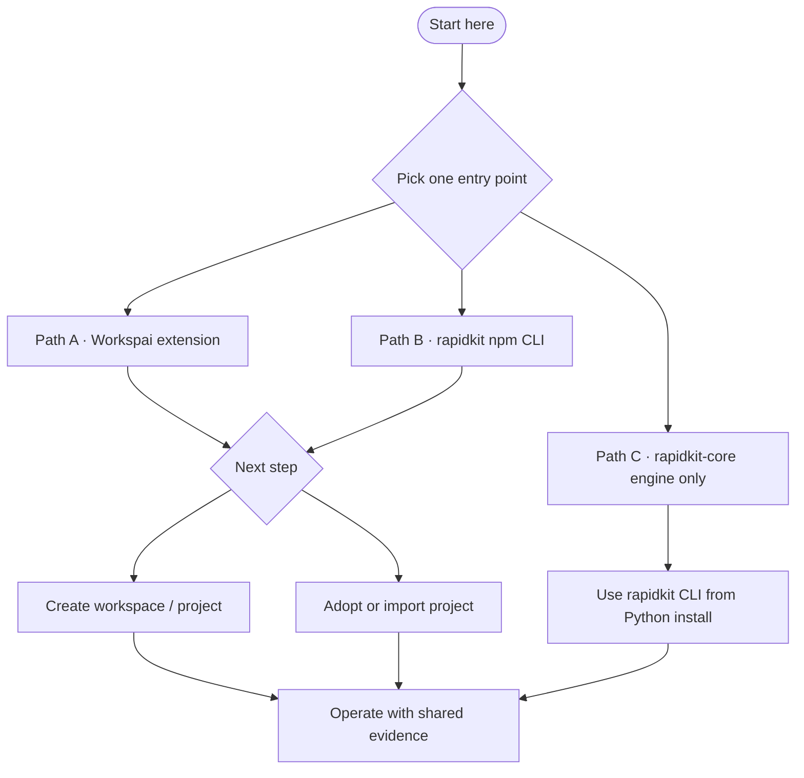

<div align="center">

# RapidKit Labs

**Open-source workspace intelligence for software systems.**

Create, adopt, govern, verify, and align workspaces for humans, CI, IDEs, and AI agents.

[](https://getrapidkit.com)
[](https://workspai.com)
[](https://marketplace.visualstudio.com/items?itemName=rapidkit.rapidkit-vscode)
[](https://www.npmjs.com/package/rapidkit)
[](https://pypi.org/project/rapidkit-core/)
[](LICENSE)

[Install Workspai](https://marketplace.visualstudio.com/items?itemName=rapidkit.rapidkit-vscode) · [npm CLI](https://www.npmjs.com/package/rapidkit) · [PyPI engine](https://pypi.org/project/rapidkit-core/) · [RapidKit](https://getrapidkit.com) · [Workspai Docs](https://workspai.com/docs) · [Discussions](https://github.com/rapidkitlabs/rapidkit-vscode/discussions)

</div>

---

## What we build

**RapidKit Labs** is the public GitHub organization behind **RapidKit** ([getrapidkit.com](https://getrapidkit.com)) and **Workspai** ([workspai.com](https://workspai.com)) — workspace intelligence for teams that ship more than one repo, runtime, or framework.

> **Why workspace-first?** Your system is rarely one repository. RapidKit makes the **workspace** the operating boundary: projects, policy, health evidence, release gates, and AI context stay in one governed place — so developers, CI, and agents work from the same truth instead of drifting silos.

**Workspai** (VS Code) is the command center: Dashboard, Repair flow, evidence cards, Studio for governed fixes, and Advisor for read-only guidance — all backed by versioned CLI contracts and workspace artifacts under `.rapidkit/`.

**`rapidkit` on npm** is the canonical CLI bridge: create, adopt, doctor, workspace intelligence (`model`, `impact`, `verify`, `context`, `explain`), and governance (`pipeline`, `readiness`).

**`rapidkit-core` on PyPI** is the Python engine for modules, doctor, bootstrap, and deep runtime operations inside adopted projects.

Supported project families include **FastAPI**, **NestJS**, **Next.js/React**, **Spring Boot**, **Go (Fiber/Gin)**, and **ASP.NET Core**.

---

## How the pieces fit

```text
rapidkit-npm (CLI + contracts)     canonical command & contract surface
        │
        ├── rapidkit-vscode        Workspai — Dashboard, Studio, evidence UI
        │
        └── rapidkit-core          Python engine — modules, doctor, project runtime
```

- **npm owns truth** — versioned contracts (`commands --json`, `--version --json`, report schemas).
- **Extension consumes** — gates, evidence cards, and Studio handoffs align to npm contracts.
- **Core delegates** — when a workspace uses the Python install backend, the npm CLI bridges to local project runtimes.

---

## Public repositories

| Repository | Description |
| --- | --- |
| [rapidkit-vscode](https://github.com/rapidkitlabs/rapidkit-vscode) | **Workspai** — Workspace Intelligence for VS Code (Dashboard, Studio, Advisor) |
| [rapidkit-npm](https://github.com/rapidkitlabs/rapidkit-npm) | Official **`rapidkit`** CLI on npm — create, adopt, govern, verify |
| [rapidkit-core](https://github.com/rapidkitlabs/rapidkit-core) | Python engine — modules, doctor, bootstrap, reports |
| [rapidkit-examples](https://github.com/rapidkitlabs/rapidkit-examples) | Example workspaces and starter templates |
| [rapidkitlabs](https://github.com/rapidkitlabs/rapidkitlabs) | Organization profile (this repository) |

---

## Getting started

Pick **one entry point**. You do not need all three.

After install, either **create** a workspace/project or **adopt / import** an existing one.



### Path A — Workspai extension (recommended)

Dashboard, evidence cards, Repair flow, Studio, and Advisor in VS Code. Requires GitHub Copilot language models for AI features.

**Install**

- Marketplace: [rapidkit.rapidkit-vscode](https://marketplace.visualstudio.com/items?itemName=rapidkit.rapidkit-vscode)
- Or from a terminal:

```bash
code --install-extension rapidkit.rapidkit-vscode
```

**First steps**

1. Command Palette → **Workspai: Open Dashboard**
2. Create a workspace or adopt an existing project
3. Run **Governance Gate** or **Doctor** from the Dashboard
4. Use **Repair** or **Studio** when a card shows a blocker

---

### Path B — `rapidkit` npm CLI

Workspace intelligence CLI. Requires **Node.js 20+** ([details](https://github.com/rapidkitlabs/rapidkit-npm#requirements)).

```bash
npx rapidkit --help
npx rapidkit commands --json
npx rapidkit --version --json
```

**Create a governed workspace**

```bash
npx rapidkit my-platform --yes --profile polyglot
cd ~/rapidkit/workspaces/my-platform

npx rapidkit bootstrap --profile polyglot
npx rapidkit create project fastapi.standard api --yes
npx rapidkit create project nextjs my-web --yes
```

**Workspace intelligence & governance**

```bash
npx rapidkit workspace model --json --write
npx rapidkit workspace impact --json
npx rapidkit workspace verify --json
npx rapidkit workspace context --for-agent --json --write
npx rapidkit doctor workspace
npx rapidkit pipeline --json --strict
```

**Adopt an existing project**

```bash
npx rapidkit adopt /path/to/project
npx rapidkit import ../orders-api
```

**Essential commands** (full list in [rapidkit-npm README](https://github.com/rapidkitlabs/rapidkit-npm#core-commands)):

| Goal | Command |
| --- | --- |
| Create workspace | `npx rapidkit <name> --yes --profile <profile>` |
| Bootstrap workspace | `npx rapidkit bootstrap` |
| Setup runtime | `npx rapidkit setup python` · `node` · `go` · `java` · `dotnet` |
| Add project | `npx rapidkit create project <kit> <name>` |
| Adopt project | `npx rapidkit adopt <path>` |
| Import project | `npx rapidkit import <path-or-git-url>` |
| Health check | `npx rapidkit doctor workspace` |
| Workspace model | `npx rapidkit workspace model --json --write` |
| Agent context | `npx rapidkit workspace context --for-agent --json --write` |
| Governance pipeline | `npx rapidkit pipeline --json --strict` |
| Run project | `npx rapidkit init` · `npx rapidkit dev` |

---

### Path C — Python engine only

Use RapidKit Core directly — no VS Code extension and no npm CLI required.

Requires **Python 3.10+**. Package: [pypi.org/project/rapidkit-core](https://pypi.org/project/rapidkit-core/)

**Install (recommended: isolated CLI)**

```bash
pipx install rapidkit-core
rapidkit --version
rapidkit --help
```

**Alternative (current interpreter / venv)**

```bash
python -m pip install -U rapidkit-core
rapidkit --version
```

**First steps**

```bash
rapidkit create
rapidkit create project fastapi.standard my-api
cd my-api
rapidkit init
rapidkit dev
```

Docs and engine issues: [rapidkit-core](https://github.com/rapidkitlabs/rapidkit-core)

---

## Example workspaces

Clone from [rapidkit-examples](https://github.com/rapidkitlabs/rapidkit-examples):

- [quickstart-workspace](https://github.com/rapidkitlabs/rapidkit-examples/tree/main/quickstart-workspace)
- [saas-starter-workspace](https://github.com/rapidkitlabs/rapidkit-examples/tree/main/saas-starter-workspace)
- [my-ai-workspace](https://github.com/rapidkitlabs/rapidkit-examples/tree/main/my-ai-workspace)

```bash
git clone https://github.com/rapidkitlabs/rapidkit-examples.git
cd rapidkit-examples/quickstart-workspace
npx rapidkit bootstrap
npx rapidkit doctor workspace
```

More templates: [workspai.com/examples](https://workspai.com/examples)

---

## Where to get help

| Need | Channel |
| --- | --- |
| Extension / Workspai | [rapidkit-vscode/issues](https://github.com/rapidkitlabs/rapidkit-vscode/issues) |
| npm CLI | [rapidkit-npm/issues](https://github.com/rapidkitlabs/rapidkit-npm/issues) |
| Python engine | [rapidkit-core/issues](https://github.com/rapidkitlabs/rapidkit-core/issues) |
| Questions | [rapidkit-vscode/discussions](https://github.com/rapidkitlabs/rapidkit-vscode/discussions) |
| RapidKit platform | [getrapidkit.com](https://getrapidkit.com) |
| Workspai | [workspai.com](https://workspai.com) |
| Support email | support@getrapidkit.com |

When reporting an issue, include OS, the path you use (extension / npm / pipx), and version output:

```bash
npx rapidkit --version --json    # npm CLI
rapidkit --version               # Python engine
```

For extension issues, also include the Workspai version from VS Code → Extensions.

---

## Contributing

Pull requests and issues are welcome. Open them in the repo that owns the layer you are changing:

| Layer | Repository |
| --- | --- |
| Dashboard, Studio, Advisor, evidence UI | [rapidkit-vscode](https://github.com/rapidkitlabs/rapidkit-vscode) |
| npm CLI, contracts, publish payload | [rapidkit-npm](https://github.com/rapidkitlabs/rapidkit-npm) |
| Modules, doctor, Python runtime | [rapidkit-core](https://github.com/rapidkitlabs/rapidkit-core) |
| Public starters | [rapidkit-examples](https://github.com/rapidkitlabs/rapidkit-examples) |

**Contract rule:** npm is the canonical contract producer; extension changes that depend on new CLI surfaces should land in `rapidkit-npm` first, then sync contracts into `rapidkit-vscode`.

---

## License

Open-source repositories in this organization are released under the [MIT License](LICENSE) unless otherwise noted in the repository.

---

<div align="center">

**[getrapidkit.com](https://getrapidkit.com)** · **[workspai.com](https://workspai.com)** · **[VS Code](https://marketplace.visualstudio.com/items?itemName=rapidkit.rapidkit-vscode)** · **[npm](https://www.npmjs.com/package/rapidkit)** · **[PyPI](https://pypi.org/project/rapidkit-core/)**

Built by RapidKit Labs

</div>
