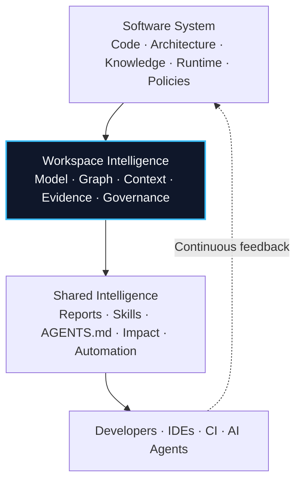

<div align="center">

# Chistiq

## Building the open-source infrastructure for AI-native workspaces

Home of **RapidKit Core**, **Workspai**, and the technologies that enable developers, IDEs, CI, and AI agents to operate from a shared understanding of software.

[RapidKit](https://www.getrapidkit.com) · [Workspai](https://www.workspai.com) · [Learn Workspace Intelligence](https://workspai.dev) · [GitHub](https://github.com/chistiq)

[](https://www.npmjs.com/package/workspai)
[](https://marketplace.visualstudio.com/items?itemName=rapidkit.rapidkit-vscode)
[](https://pypi.org/project/rapidkit-core/)

</div>

---

# What is Chistiq?

Chistiq builds the open-source infrastructure for AI-native workspaces.

Instead of treating software as disconnected repositories, files, and prompts, Chistiq enables developers, AI agents, IDEs, and engineering systems to operate from a shared workspace model built on architecture, context, knowledge, governance, and execution.

The ecosystem is powered by **RapidKit Core** and experienced through **Workspai**, bringing Workspace Intelligence into everyday software development.

---

# Workspace Intelligence

Software is more than source code.

It includes architecture, relationships, dependencies, operational knowledge, ownership, runtime behavior, governance, and the decisions that shape how systems evolve.

Workspace Intelligence transforms those signals into a shared, evidence-backed model that humans and AI can understand together.



---

# Products

| Product | Purpose |
| --- | --- |
| **RapidKit Core** | Open-source platform for modeling software workspaces and building Workspace Intelligence. |
| **Workspai CLI** | Workspace operations, contracts, governance, automation, and AI workflows. |
| **Workspai for VS Code** | Workspace Intelligence inside the developer workflow. |
| **Reference Workspaces** | Example projects, reusable workspace kits, and adoption guides. |

---

# Adopt Existing Software

Existing projects can be adopted without changing repositories, frameworks, or languages.

```bash
npx workspai adopt ../existing-project --json

cd ~/.workspai/workspaces/workspai

npx workspai workspace model --write
npx workspai workspace context --for-agent --write
npx workspai workspace verify --strict
```

Once modeled, the same workspace intelligence powers documentation, AI grounding, impact analysis, governance, release workflows, and developer tooling.

---

# Ecosystem

| Project | Description |
| --- | --- |
| **RapidKit** | Open-source platform for Workspace Intelligence. |
| **Workspai** | Developer experience for Workspace Intelligence. |
| **workspai.dev** | Documentation, guides, and learning resources. |

---

# Open Source

Chistiq is built in the open.

We believe software should be understandable, governable, and shared between humans and AI through explicit contracts, evidence, and reusable workspace knowledge.

---

<div align="center">

## One workspace. One truth.

### Shared by humans and AI.

</div>
