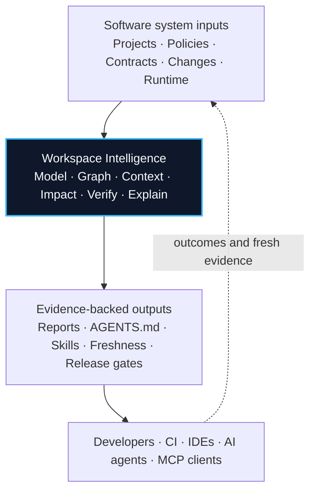

<div align="center">

# RapidKit Labs

## Open-source infrastructure for building and understanding software systems

Home of **Workspai**, **RapidKit Core**, and the shared contracts that align
developers, CI, IDEs, and AI agents around one software-system truth.

[RapidKit Labs](https://www.getrapidkit.com) · [Workspai](https://www.workspai.com) · [Learn Workspace Intelligence](https://workspai.dev) · [GitHub](https://github.com/rapidkitlabs)

[](https://www.npmjs.com/package/workspai)
[](https://marketplace.visualstudio.com/items?itemName=rapidkit.rapidkit-vscode)
[](https://pypi.org/project/rapidkit-core/)

</div>

---

## Workspace Intelligence

AI tools can read code. Software systems also have projects, dependencies,
runtime boundaries, policies, ownership, operational evidence, and release
decisions. Workspai turns those facts into a shared, evidence-backed model.



Existing projects can enter this architecture through adopt or import without
changing their language, framework, or source location. First-class create kits
are available when a team needs to start a new project.

## Products

| Product | Responsibility | Start |
| --- | --- | --- |
| **Workspai CLI** | Canonical Workspace Intelligence engine, contracts, governance, and agent grounding | [`npx workspai --help`](https://www.npmjs.com/package/workspai) |
| **Workspai for VS Code** | Visual workspace operations, evidence, repair, and AI workflows | [Install extension](https://marketplace.visualstudio.com/items?itemName=rapidkit.rapidkit-vscode) |
| **RapidKit Core** | Python engine for core-backed generation, modules, and doctor workflows | [Open repository](https://github.com/rapidkitlabs/rapidkit-core) |
| **Reference Workspaces** | Reproducible examples and adoption patterns | [Explore examples](https://github.com/rapidkitlabs/rapidkit-examples) |

## Start With Existing Software

```bash
npx workspai adopt ../existing-project --json
cd ~/.workspai/workspaces/workspai
npx workspai workspace model --json --write
npx workspai workspace context --for-agent --json --write
npx workspai workspace agent-sync --write --refresh-context
npx workspai workspace verify --strict --json
```

The same evidence can produce workspace reports, `AGENTS.md`, Skills, IDE
grounding, CI gates, impact analysis, and release decisions.

## Domain Map

| Domain | Role |
| --- | --- |
| [getrapidkit.com](https://www.getrapidkit.com) | RapidKit Labs brand and product ecosystem |
| [workspai.dev](https://workspai.dev) | Workspace Intelligence knowledge portal |
| [workspai.com](https://www.workspai.com) | Workspai product and online experience |

## Open Source

We build in public and value evidence before confidence, explicit contracts,
honest capability boundaries, and software that remains useful across languages
and frameworks.

[Workspai source](https://github.com/rapidkitlabs/workspai) · [Issues](https://github.com/rapidkitlabs/workspai/issues) · [Discussions](https://github.com/rapidkitlabs/workspai/discussions)

---

<div align="center">

**One workspace. One truth. Humans and AI aligned.**

</div>
